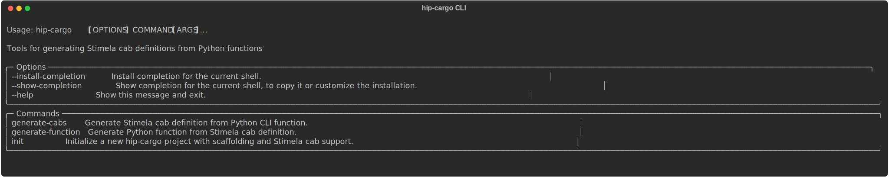

# hip-cargo

`hip-cargo` is an attempt to liberate developers from maintaining their packages in [`cult-cargo`](https://github.com/caracal-pipeline/cult-cargo).
The core concept boils down to maintaining a lightweight package that only installs the [`stimela`](https://github.com/caracal-pipeline/stimela) cabs required to run a linked and versioned containerized image of the package.
This makes it possible to install the package alongside `cult-cargo` and include cabs into recipes using the syntax
```yaml
_include:
  - (module)cab_name.yml
```
In principle, that's all there is to it.
The `hip-cargo` package does not dictate how you should go about structuring your package.
Instead, it serves as an example of how to design auto-documenting CLI interfaces using Typer.
It also provides some utilities to convert function signatures into `stimela` cabs and vice versa for packages that mimic its structure.

## Installation

```bash
pip install hip-cargo
```

Or for development:

```bash
git clone https://github.com/landmanbester/hip-cargo.git
cd hip-cargo
uv sync
```

The latter is probably more useful if you want to use `hip-cargo` as a template for your own package.

## Key Principles

1. **Separate CLI from implementation**: Keep CLI modules lightweight with lazy imports. Keep them all in the `src/mypackage/cli` directory and define the CLI for each command in a separate file. Construct the main Typer app in `src/mypackage/cli/__init__.py` and register commands there.
2. **Separate cabs directory at same level as `cli`**: Use `hip-cargo` to auto-generate cabs into in `src/mypackage/cabs/` directory with the `generate_cabs.py` script. There should be a separate file for each cab.
3. **Single app, multiple commands**: Use one Typer app that registers all commands. If you need a separate app you might as well create a separate repository for it.
4. **Lazy imports**: Import heavy dependencies (NumPy, JAX, Dask) only when executing
5. **Linked GitHub package with container image**: Maintain an up to date `Dockerfile` that installs the full package and use **Docker** (or **Podman**) to upload the image to the GitHub Container registry. Link this to your GitHub repository.

## Quick Start
The following instructions provide a guide on how to structure a package for use with `hip-cargo`.
Note that `hip-cargo` itself follows exactly this structure and will be used as the running example throughout.
It provides two utility functions viz.

* `generate-cabs`: Generate cabs from Typer CLI definitions.
* `generate-function`: Generate a Typer CLI definition from a cab.

By default, `hip-cargo` installs a lightweight version of the package that only provides the CLI and the cab definitions required for using the linked container image with `stimela`.
Upon installation, an executable called `cargo` is added to the `PATH`.
`cargo` is a Typer command group containing multiple commands.
Available commands can be listed using
```bash
cargo --help
```
This should print something like the following



Documentation on each individual command can be obtained by calling help for the command e.g.
```bash
cargo generate-cabs --help
```
The full package should be available as a container image on the [GitHub Container Registry](https://docs.github.com/en/packages/working-with-a-github-packages-registry/working-with-the-container-registry).
The `Dockerfile` for the project should install the package in `full` mode.
This is used to build the container image that is uploaded to the registry.
The image should be tagged with a version so that `stimela` knows how to match cab configuration to images.
The following versioning schema is proposed:

* use semantic versioning for releases
* use `latest` tag for `main`/`master` branch
* use `branch-name` when developing new features

GitHub actions should be set up to build and push the container image to the registry.
The image should be tagged with the version and the branch name.
The image should be pushed to the registry using the `ghcr.io` domain.
One snag is that one needs to know the version in order to create the cabs.
Since `hip-cargo` is available on the GRH, the `generate-cabs` command can be used GitHub actions to achieve this.
Let's start with the expected package structure.

## Package Structure

We recommend using [uv](https://docs.astral.sh/uv/) as the package manager.
Initialize your project with the following structure (again using `hip-cargo` as the example):

```
hip-cargo/
├── .github
│   ├── dependabot.yml
│   └── workflows
│       ├── ci.yml
│       ├── publish-container.yml
│       └── publish.yml
├── src
│   └── hip_cargo
│       ├── cabs
│       │   ├── generate_cabs.yml
│       │   ├── generate_function.yml
│       │   ├── __init__.py
│       ├── cli
│       │   ├── generate_cabs.py
│       │   ├── generate_function.py
│       │   ├── __init__.py
│       ├── core
│       │   ├── generate_cabs.py
│       │   ├── generate_function.py
│       │   ├── __init__.py
├── Dockerfile                   # For containerization
├── LICENSE                      # MIT or BSD3 license encouraged
├── .pre-commit-config.yaml      # You should use these if you don't already
├── .gitignore                   # make sure your .lock file is not ignored
├── pyproject.toml               # PEP 621 compliant
├── tbump.toml                   # this makes releases so much easier
├── tests                        # obviously we need these
│   ├── conftest.py
│   ├── __init__.py
└── README.md                    # We are going to put all the docs in the project README's :no_mouth:

```
With this in place, we are ready to start.

### 1. Decorate your Python CLI

`uv` expects your modules to live in `src/mypackage/`.
As an example, let's see what the `generate-cabs` command looks like

<!-- CODE:generate-cabs:START -->
```python
"""CLI command for generating Stimela cab definitions."""

from pathlib import Path
from typing import NewType

import typer
from rich import print
from typing_extensions import Annotated

from hip_cargo.utils.decorators import stimela_cab, stimela_output

File = NewType("File", Path)
Directory = NewType("Directory", Path)


@stimela_cab(
    name="generate_cabs",
    info="Generate Stimela cab definition from Python CLI function",
)
@stimela_output(
    dtype="Directory",
    name="output_dir",
    info="Path to output directory where cab definitions will be saved. "
    "The cab will have the exact same name as the command.",
)
def generate_cabs(
    module: Annotated[
        File,
        typer.Option(
            ...,
            parser=File,
            help="CLI module path. "
            "Use wild card to generate cabs for multiple commands in module (e.g. package/cli/*). ",
            rich_help_panel="Inputs",
        ),
    ],
    output_dir: Annotated[
        Directory,
        typer.Option(
            parser=Directory,
            help="Output directory for cab definition. The cab will have the exact same name as the command.",
            rich_help_panel="Outputs",
        ),
    ] = None,
    image: Annotated[
        File,
        typer.Option(parser=File, help="pyproject.toml associated with the module. ", rich_help_panel="Inputs"),
    ] = None,
):
    """Generate a Stimela cab definition from a Python module.

    The module should contain a single Typer command decorated with
    @stimela_cab and optionally @stimela_output decorators.
    """
    # Lazy imports
    from hip_cargo.core.generate_cabs import generate_cabs as generate_cabs_core  # noqa: E402

    # glob if wildcard in module
    modpath = Path(module)
    if "*" in module:
        base_path = Path(str(modpath).split("*")[0].rstrip("/"))
        modlist = [f for f in base_path.glob("*") if f.is_file() and not f.name.startswith("__")]
        if len(modlist) == 0:
            raise RuntimeError(f"No modules found matching {module}")
    else:
        if not modpath.is_file():
            raise RuntimeError(f"No module file found at {module}")
        modlist = [modpath]

    # User feedback
    for mod in modlist:
        typer.echo(f"Loading file: {mod}")

    typer.echo(f"Writing cabs to: {output_dir}")

    # Call core logic
    generate_cabs_core(modlist, str(output_dir), image)

    # Success message
    print(f":boom: [green] Successfully generated cabs in: {output_dir} [/green]")
```
<!-- CODE:generate-cabs:END -->

Each CLI module should be a separate file and all modules need to be registered as commands inside `src/cli/__init__.py`.
For `hip-cargo`, this is what it looks like

<!-- CODE:__init__:START -->
```python
"""Lightweight CLI for hip-cargo."""

import typer

app = typer.Typer(
    name="cargo",
    help="Tools for generating Stimela cab definitions from Python functions",
    no_args_is_help=True,
)


@app.callback()
def callback():
    """hip-cargo: a guide to designing self-documenting CLI interfaces using Typer + conversion utilities."""
    pass


# Register commands
from hip_cargo.cli.generate_cabs import generate_cabs  # noqa: E402
from hip_cargo.cli.generate_function import generate_function  # noqa: E402

app.command(name="generate-cabs")(generate_cabs)
app.command(name="generate-function")(generate_function)

__all__ = ["app"]
```
<!-- CODE:__init__:END -->

So we have two commands registered.
That's all we'll need for this demo.

## 2 Packaging
This is one of the core design principles.
The package `pyproject.toml` needs to be PEP 621 compliant and it needs to enable a lightweight mode by default but also specify what the full dependencies are.
For `hip-cargo`, it looks like the following:

<!-- CODE:pyprojecttoml:START -->
```python
[project]
name = "hip-cargo"
version = "0.1.2"
description = "Tools for generating Stimela cab definitions from Python functions"
readme = "README.md"
requires-python = ">=3.10"
license = { text = "MIT" }
authors = [
    { name = "landmanbester", email = "lbester@sarao.ac.za" }
]
keywords = ["stimela", "typer", "cli", "yaml", "code-generation", "radio-astronomy"]
classifiers = [
    "Development Status :: 4 - Beta",
    "Intended Audience :: Developers",
    "Intended Audience :: Science/Research",
    "License :: OSI Approved :: MIT License",
    "Programming Language :: Python :: 3",
    "Programming Language :: Python :: 3.10",
    "Programming Language :: Python :: 3.11",
    "Programming Language :: Python :: 3.12",
    "Topic :: Software Development :: Code Generators",
    "Topic :: Software Development :: Libraries :: Python Modules",
    "Topic :: Scientific/Engineering :: Astronomy",
]
dependencies = [
    "typer>=0.12.0",
    "pyyaml>=6.0",
    "typing-extensions>=4.15.0",
]

[project.urls]
Homepage = "https://github.com/landmanbester/hip-cargo"
Repository = "https://github.com/landmanbester/hip-cargo"
"Bug Tracker" = "https://github.com/landmanbester/hip-cargo/issues"

[project.scripts]
cargo = "hip_cargo.cli:app"

[build-system]
requires = ["uv_build>=0.8.3,<0.10.0"]
build-backend = "uv_build"

[tool.ruff]
line-length = 120
target-version = "py310"

[tool.ruff.lint]
select = ["E", "F", "I", "N", "W"]
ignore = []

[tool.ruff.format]
quote-style = "double"
indent-style = "space"

[tool.pytest.ini_options]
testpaths = ["tests"]
python_files = ["test_*.py", "*_test.py"]
python_classes = ["Test*"]
python_functions = ["test_*"]
addopts = [
    "--strict-markers",
    "--strict-config",
    "--verbose",
]
markers = [
    "unit: Unit tests",
    "integration: Integration tests",
    "slow: Tests that take more time to run",
]

[dependency-groups]
dev = [
    "pytest>=8.4.2",
    "ruff>=0.13.2",
    "tbump>=6.11.0",
    "pre-commit>=4.0.0",
    "ipdb"
]
test = [
    "pytest>=8.0.0",
    "pytest-cov>=5.0.0",
]
```
<!-- CODE:pyprojecttoml:END -->


## Container Images and GitHub Actions

For Stimela to use your package in containerized environments, you should publish OCI container images to GitHub Container Registry (ghcr.io). This section shows how to automate this with GitHub Actions.

### 1. Create a Dockerfile

Add a `Dockerfile` at the root of your repository:

```dockerfile
FROM python:3.11-slim

WORKDIR /app

# Install uv for fast package installation
COPY --from=ghcr.io/astral-sh/uv:latest /uv /usr/local/bin/uv

# Copy package files
COPY pyproject.toml README.md ./
COPY src/ src/

# Install package with full dependencies using uv (much faster than pip)
RUN uv pip install --system --no-cache .

# Make CLI available
ENTRYPOINT ["mypackage"]
CMD ["--help"]
```

### 2. Set up GitHub Actions Workflow

Create `.github/workflows/publish-container.yml`:

```yaml
name: Build and Publish Container

on:
  push:
    tags:
      - 'v*.*.*'  # Trigger on version tags (e.g., v1.0.0)
  workflow_dispatch:  # Allow manual triggering

env:
  REGISTRY: ghcr.io
  IMAGE_NAME: ${{ github.repository }}

jobs:
  build-and-push:
    runs-on: ubuntu-latest
    permissions:
      contents: read
      packages: write

    steps:
      - name: Checkout repository
        uses: actions/checkout@v5

      - name: Log in to Container Registry
        uses: docker/login-action@v3
        with:
          registry: ${{ env.REGISTRY }}
          username: ${{ github.actor }}
          password: ${{ secrets.GITHUB_TOKEN }}

      - name: Extract metadata (tags, labels)
        id: meta
        uses: docker/metadata-action@v5
        with:
          images: ${{ env.REGISTRY }}/${{ env.IMAGE_NAME }}
          tags: |
            type=semver,pattern={{version}}
            type=semver,pattern={{major}}.{{minor}}
            type=semver,pattern={{major}}
            type=sha,prefix={{branch}}-

      - name: Build and push Docker image
        uses: docker/build-push-action@v5
        with:
          context: .
          push: true
          tags: ${{ steps.meta.outputs.tags }}
          labels: ${{ steps.meta.outputs.labels }}
```

### 3. Link Container to GitHub Package

To associate the container image with your repository:

1. **Automatic linking**: If your workflow pushes to `ghcr.io/username/repository-name`, GitHub automatically creates a package linked to the repository.

2. **Manual linking** (if needed):
   - Go to your repository on GitHub
   - Navigate to the "Packages" section
   - Click on your container package
   - Click "Connect repository" in the sidebar
   - Select your repository from the dropdown

3. **Set package visibility**:
   - In the package settings, set visibility to "Public" for open-source projects
   - This allows Stimela to pull images without authentication

### 4. Version Tagging Best Practices

The workflow above creates multiple tags for each release:

```bash
# For release v1.2.3, creates:
ghcr.io/username/mypackage:1.2.3    # Full version
ghcr.io/username/mypackage:1.2      # Minor version
ghcr.io/username/mypackage:1        # Major version
ghcr.io/username/mypackage:main-sha123456  # Branch + commit SHA
```

This allows users to pin to specific versions or track latest minor/major releases.

### 5. Triggering a Build

**Automated (recommended):**
```bash
# Create and push a version tag
git tag v1.0.0
git push origin v1.0.0
```

The GitHub Action will automatically build and publish the container.

**Manual:**
- Go to "Actions" tab in GitHub
- Select "Build and Publish Container"
- Click "Run workflow"

### 6. Using the Container with Stimela

Once published, users can reference your container in Stimela recipes:

```yaml
cabs:
  - name: mypackage
    image: ghcr.io/username/mypackage:1.0.0
```

Stimela will automatically pull the matching version based on the cab configuration.

### 7. Local Testing

Test your container locally before pushing:

```bash
# Build
docker build -t mypackage:test .

# Run
docker run --rm mypackage:test --help
docker run --rm mypackage:test process --help

# Test with mounted data
docker run --rm -v $(pwd)/data:/data mypackage:test process /data/input.ms
```

## Type Inference

`hip-cargo` automatically recognizes custom `stimela` types. The `generate-cab` command should add
```python
from pathlib import Path
from typing import NewType

MS = NewType("MS", Path)
Directory = NewType("Directory", Path)
URI = NewType("URI", Path)
File = NewType("File", Path)
```

to the preamble of functions generated from cabs that use these types.
It should also add the `parser` bit to the type hint Annotation e.g. for the custom `MS` dtype we need
```
def process(input_ms: Annotated[MS, typer.Option(parser=MS)]):
    pass
```
One quirk of this approach is that parameters which have `None` as the default need to be defined as e.g.
```
def process(input_ms: Annotated[MS | None, typer.Option(parser=MS)]) = None:
    pass
```
Python then parses this as `Optional[MS]` which is just an alias for `Union[MS | None]`. This should be handled correctly such that the `generate-cab` command places `dtype: MS` in the cab definition and the `generate-function` command correctly generates the function signature above. These custom types are currently limited to only two possible types in the `Union` and should be specified using the newer `dtype1 | dtype2` format in the function definition (one of which may be `None`). All standard python types should just work.

## Decorators

### `@stimela_cab`

Marks a function as a Stimela cab.

- `name`: Cab name
- `info`: Description
- `policies`: Optional dict of cab-level policies

### `@stimela_output`

Defines a `stimela` output. When defining functions from cabs the `generate-function` command should check for the following parameter fields

- `name`: Output name (top level, one below `cabs`)
- `dtype`: Data type (File, Directory, MS, etc.)
- `info`: Help string
- `required`: Whether output is required (default: False)
- `implicit`: If implicit is `True` the parameter should not be placed in the function definition. If implicit is `False` (the default), the parameter needs to be added to the function signature.

## Features

- ✅ Automatic type inference from Python type hints
- ✅ Support for Typer Arguments (positional) and Options
- ✅ Multiple outputs automatically added to function signature if they are not implicit
- ✅ List types with automatic `repeat: list` policy
- ✅ Proper handling of default values and required parameters

## Development

This project uses:
- [uv](https://github.com/astral-sh/uv) for dependency management
- [ruff](https://github.com/astral-sh/ruff) for linting and formatting
- [typer](https://typer.tiangolo.com/) for the CLI

### Setting Up Development Environment

```bash
# Clone the repository
git clone https://github.com/landmanbester/hip-cargo.git
cd hip-cargo

# Install dependencies with development tools
uv sync --group dev

# Install pre-commit hooks (recommended)
uv run pre-commit install
```

### Pre-commit Hooks

This project uses [pre-commit](https://pre-commit.com/) to automatically check code quality before commits. The hooks run:

- **ruff linting**: Checks code style and catches common errors
- **ruff formatting**: Ensures consistent code formatting
- **trailing whitespace**: Removes trailing whitespace
- **end-of-file-fixer**: Ensures files end with a newline
- **check-yaml**: Validates YAML syntax
- **check-toml**: Validates TOML syntax
- **check-merge-conflict**: Prevents committing merge conflict markers
- **check-added-large-files**: Prevents accidentally committing large files

#### Installing Pre-commit Hooks

After cloning the repository, install the pre-commit hooks:

```bash
uv run pre-commit install
```

This will automatically run the hooks before each commit. If any checks fail, the commit will be blocked until you fix the issues.

#### Running Hooks Manually

You can run the hooks manually on all files:

```bash
# Run on all files
uv run pre-commit run --all-files

# Run on staged files only
uv run pre-commit run
```

#### Updating Hook Versions

To update hook versions to the latest:

```bash
uv run pre-commit autoupdate
```

### Manual Code Quality Checks

If you prefer to run checks manually without pre-commit:

```bash
# Format code
uv run ruff format .

# Check and auto-fix linting issues
uv run ruff check . --fix

# Run tests
uv run pytest -v

# Run tests with coverage
uv run pytest --cov=hip_cargo --cov-report=term-missing
```

### Contributing Workflow

1. **Create a feature branch**:
   ```bash
   git checkout -b feature/your-feature-name
   ```

2. **Make your changes** and ensure tests pass:
   ```bash
   uv run pytest -v
   ```

3. **Format and lint** (automatically done by pre-commit):
   ```bash
   git add .
   git commit -m "feat: your feature description"
   # Pre-commit hooks run automatically
   ```

4. **Push and create a pull request**:
   ```bash
   git push origin feature/your-feature-name
   ```

## License

MIT License
