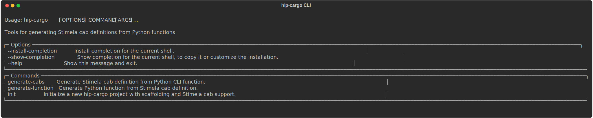

# hip-cargo

`hip-cargo` is an attempt to liberate developers from maintaining their packages in [`cult-cargo`](https://github.com/caracal-pipeline/cult-cargo).
The core concept boils down to maintaining a lightweight package that only installs the [`stimela`](https://github.com/caracal-pipeline/stimela) cabs required to run a linked and versioned containerized image of the package.
This makes it possible to install the package alongside `cult-cargo` and include cabs into recipes using the syntax
```yaml
_include:
  - (module.cabs)cab_name.yml
```
In principle, that's all there is to it.
The `hip-cargo` package does not dictate how you should go about structuring your package.
Instead, it serves as an example of how to design auto-documenting CLI interfaces using Typer with automated cab generation and containerisation.
It provides utilities to convert function signatures into `stimela` cabs (and vice versa) for packages that mimic its structure.

## Installation

```bash
pip install hip-cargo
```

Or for development:

```bash
git clone https://github.com/landmanbester/hip-cargo.git
cd hip-cargo
uv sync --group dev --group test
uv run pre-commit install
```

## Key Principles

1. **Separate CLI from implementation**: Keep CLI modules lightweight with lazy imports. Keep them all in the `src/mypackage/cli` directory and define the CLI for each command in a separate file. Construct the main Typer app in `src/mypackage/cli/__init__.py` and register commands there.
2. **Separate cabs directory at same level as `cli`**: Use `hip-cargo generate-cabs` to auto-generate cabs into `src/mypackage/cabs/`. There should be a separate `src/mypackage/cli/mycommand.py` file corresponding to each cab.
3. **Single app, multiple commands**: Use one Typer app that registers all commands. If you need a separate app you might as well create a separate repository for it.
4. **Lazy imports**: Import heavy dependencies (NumPy, JAX, Dask) only when executing
5. **Linked GitHub package with container image**: Maintain an up to date `Dockerfile` that installs the full package and use **Docker** (or **Podman**) to upload the image to the GitHub Container registry. Link this to your GitHub repository.

## Quick Start
The following instructions provide a guide on how to structure a package for use with `hip-cargo`.
Note that `hip-cargo` itself follows exactly this structure and will be used as the running example throughout.
It provides three utility functions viz.

* `generate-cabs`: Generate cabs from Typer CLI definitions.
* `generate-function`: Generate a Typer CLI definition from a cab.
* `init`: Initialize and new project.

By default, `hip-cargo` installs a lightweight version of the package that only provides the CLI and the cab definitions required for using the linked container image with `stimela`.
Upon installation, an executable called `hip-cargo` is added to the `PATH`.
`hip-cargo` is a Typer command group containing multiple commands.
Available commands can be listed using
```bash
hip-cargo --help
```
This should print something like the following



Documentation on each individual command can be obtained by calling help for the command e.g.
```bash
hip-cargo generate-cabs --help
```
The full package should be available as a container image on the [GitHub Container Registry](https://docs.github.com/en/packages/working-with-a-github-packages-registry/working-with-the-container-registry).
The `Dockerfile` for the project should install the full package, not the lightweight version.
This is used to build the container image that is uploaded to the registry.
The image should be tagged with a version so that `stimela` knows how to match cab configuration to images.
The following versioning schema is proposed:

* use semantic versioning for releases
* use `latest` tag for `main`/`master` branch
* use `branch-name` when developing new features

This can all be automated with pre-commit hooks and GitHub actions.
Use pre-commit hooks to auto-generate cab definitions on each commit.
See the [publish-container](./.github/workflows/publish-container.yml) workflow for an example of how to set up GitHub Actions for automation.
We distinguish between two cases viz. initialising a project from scratch or converting an existing project.

### Using `hip-cargo` to initialise a project

The `hip-cargo init` command scaffolds a complete project with CI/CD pipelines, containerisation, pre-commit hooks, and Stimela cab support. Run it with:

```bash
hip-cargo init --project-name my-project --github-user myuser
```

This creates a ready-to-use project directory with:

- **src layout** with separate `cli/`, `core/`, and `cabs/` directories
- **pyproject.toml** (PEP 621 compliant) with `uv` as the build backend
- **GitHub Actions workflows** for CI, PyPI publishing, container publishing, and automated cab updates
- **Pre-commit hooks** for ruff formatting/linting and automatic cab regeneration
- **Dockerfile** for building container images uploaded to GitHub Container Registry
- **tbump configuration** with hooks for version bumping and cab regeneration
- **License file** (MIT, Apache-2.0, or BSD-3-Clause)
- **An `onboard` command** that prints step-by-step instructions for completing CI/CD setup

The generated project includes an `onboard` command that guides you through the remaining setup steps:

```bash
cd my-project
uv run my_project onboard
```

This prints instructions for:

1. Creating a GitHub repository (with `gh` CLI)
2. Setting up PyPI trusted publishing (OIDC, no API keys needed)
3. Creating a GitHub environment for publishing
4. Creating a GitHub App for automated cab update commits
5. Configuring branch protection with the App in the bypass list
6. Making your first release with `tbump`

Once setup is complete, you can delete the onboard command and start adding your own commands following the same pattern.

#### Init options

| Option | Default | Description |
|--------|---------|-------------|
| `--project-name` | *required* | Hyphenated project name (e.g. `my-project`) |
| `--github-user` | *required* | GitHub username or organisation |
| `--description` | `"A Python project"` | Short project description |
| `--author-name` | *from git config* | Author name |
| `--author-email` | *from git config* | Author email |
| `--cli-command` | *from project name* | CLI entry point name |
| `--initial-version` | `0.0.0` | Starting version string |
| `--license-type` | `MIT` | License (MIT, Apache-2.0, BSD-3-Clause) |
| `--cli-mode` | `multi` | `single` (one command) or `multi` (subcommands) |
| `--default-branch` | `main` | Default git branch name |
| `--project-dir` | `./<project-name>/` | Output directory |

### Transitioning an existing package

To transition an existing package that already contains `stimela` cab definitions, it is probably easiest to manually create the required directory structure (see below) and to use the `generate-function` command to convert your cabs into CLI definitions. Do this for each cab separately and register the relevant commands in your CLI module's `__init__.py`. You might want to take a look at the [template](src/hip_cargo/templates/) files and copy the necessary files across (or initialize a new blank project and just use those). This is currently a manual process, we might add an automation script (or skill) to do this in the future. Further details are provided below.


## Package Structure

We recommend using [uv](https://docs.astral.sh/uv/) as the package manager.
Initialize your project with the following structure (again using `hip-cargo` as the example):

```
hip-cargo/
├── .github
│   ├── dependabot.yml
│   └── workflows
│       ├── ci.yml
│       ├── publish-container.yml
│       ├── publish.yml
│       └── update-cabs.yml
├── src
│   └── hip_cargo
│       ├── cabs                 # Generated cab definitions (YAML)
│       │   ├── __init__.py
│       │   ├── generate_cabs.yml
│       │   └── generate_function.yml
│       ├── cli                  # Lightweight CLI wrappers
│       │   ├── __init__.py
│       │   ├── generate_cabs.py
│       │   └── generate_function.py
│       ├── core                 # Core implementations (lazy-loaded)
│       │   ├── __init__.py
│       │   ├── generate_cabs.py
│       │   └── generate_function.py
│       ├── recipes              # Stimela recipes for running commands via stimela
│       │   ├── __init__.py
│       │   └── gen_cabs.yml
│       └── utils                # Shared utilities
│           ├── __init__.py
│           ├── cab_to_function.py
│           ├── config.py        # pyproject.toml [tool.hip-cargo] reader
│           ├── decorators.py
│           ├── introspector.py
│           └── types.py         # ListInt, ListFloat, ListStr NewTypes + parsers
├── tests
│   ├── __init__.py
│   └── conftest.py
├── Dockerfile                   # For containerization
├── LICENSE                      # MIT or BSD3 license encouraged
├── .pre-commit-config.yaml      # You should use these if you don't already
├── .gitignore                   # make sure your .lock file is not ignored
├── pyproject.toml               # PEP 621 compliant
├── tbump.toml                   # this makes releases so much easier
└── README.md                    # project README

```

## Python CLI

`uv` expects your modules to live in `src/mypackage/`.
As an example, let's see what the `generate-cabs` command looks like

<!-- CODE:generate-cabs:START -->
```python
from pathlib import Path
from typing import Annotated, Literal, NewType

import typer

from hip_cargo import stimela_cab, stimela_output

Directory = NewType("Directory", Path)
File = NewType("File", Path)


@stimela_cab(
    name="generate_cabs",
    info="Generate Stimela cab definition from Python CLI function.",
)
@stimela_output(
    dtype="Directory",
    name="output-dir",
    info="Output directory for cab definition. The cab will have the exact same name as the command.",  # noqa: E501
    metadata={"rich_help_panel": "Outputs"},
)
def generate_cabs(
    module: Annotated[
        list[File],
        typer.Option(
            ...,
            parser=Path,
            help="CLI module path. "
            "Use wild card to generate cabs for multiple commands in module. "
            "For example, package/cli/*.",
            rich_help_panel="Inputs",
        ),
    ],
    image: Annotated[
        str | None,
        typer.Option(
            help="Name of container image.",
            rich_help_panel="Inputs",
        ),
    ] = None,
    output_dir: Annotated[
        Directory | None,
        typer.Option(
            parser=Path,
            help="Output directory for cab definition. The cab will have the exact same name as the command.",  # noqa: E501
            rich_help_panel="Outputs",
        ),
    ] = None,
    backend: Annotated[
        Literal["auto", "native", "apptainer", "singularity", "docker", "podman"],
        typer.Option(
            help="Execution backend.",
        ),
        {"stimela": {"skip": True}},
    ] = "auto",
    always_pull_images: Annotated[
        bool,
        typer.Option(
            help="Always pull container images, even if cached locally.",
        ),
        {"stimela": {"skip": True}},
    ] = False,
):
    """
    Generate Stimela cab definition from Python CLI function.
    """
    if backend == "native" or backend == "auto":
        try:
            # Lazy import the core implementation
            from hip_cargo.core.generate_cabs import generate_cabs as generate_cabs_core  # noqa: E402

            # Call the core function with all parameters
            generate_cabs_core(
                module,
                image=image,
                output_dir=output_dir,
            )
            return
        except ImportError:
            if backend == "native":
                raise

    # Fall back to container execution
    from hip_cargo.utils.runner import run_in_container  # noqa: E402

    run_in_container(
        generate_cabs,
        dict(
            module=module,
            image=image,
            output_dir=output_dir,
        ),
        backend=backend,
        always_pull_images=always_pull_images,
    )
```
<!-- CODE:generate-cabs:END -->

Each CLI module should be a separate file and all modules need to be registered as commands inside `src/cli/__init__.py`.
For `hip-cargo`, this is what it looks like

<!-- CODE:__init__:START -->
```python
"""Lightweight CLI for hip-cargo."""

import typer

app = typer.Typer(
    name="hip-cargo",
    help="Tools for generating Stimela cab definitions from Python functions",
    no_args_is_help=True,
)


@app.callback()
def callback():
    """hip-cargo: a guide to designing self-documenting CLI interfaces using Typer + conversion utilities."""
    pass


# Register commands
from hip_cargo.cli.generate_cabs import generate_cabs  # noqa: E402
from hip_cargo.cli.generate_function import generate_function  # noqa: E402
from hip_cargo.cli.init import init  # noqa: E402

app.command(name="generate-cabs")(generate_cabs)
app.command(name="generate-function")(generate_function)
app.command(name="init")(init)

__all__ = ["app"]
```
<!-- CODE:__init__:END -->

So we have two commands registered.
That's all we'll need for this demo.

## Packaging
This is one of the core design principles.
The package `pyproject.toml` needs to be PEP 621 compliant, and it needs to enable a lightweight mode by default but also specify what the full dependencies are.
For `hip-cargo`, it looks like the following:

<!-- CODE:pyprojecttoml:START -->
```python
[project]
name = "hip-cargo"
version = "0.1.5"
description = "Tools for generating Stimela cab definitions from Python functions"
readme = "README.md"
requires-python = ">=3.10"
license = { text = "MIT" }
authors = [
    { name = "landmanbester", email = "lbester@sarao.ac.za" }
]
keywords = ["stimela", "typer", "cli", "yaml", "code-generation", "radio-astronomy"]
classifiers = [
    "Development Status :: 4 - Beta",
    "Intended Audience :: Developers",
    "Intended Audience :: Science/Research",
    "License :: OSI Approved :: MIT License",
    "Programming Language :: Python :: 3",
    "Programming Language :: Python :: 3.10",
    "Programming Language :: Python :: 3.11",
    "Programming Language :: Python :: 3.12",
    "Topic :: Software Development :: Code Generators",
    "Topic :: Software Development :: Libraries :: Python Modules",
    "Topic :: Scientific/Engineering :: Astronomy",
]
dependencies = [
    "typer>=0.12.0",
    "pyyaml>=6.0",
    "typing-extensions>=4.15.0",
    "libcst==1.8.6",
    "tomli>=2.0; python_version < '3.11'",
]

[project.urls]
Homepage = "https://github.com/landmanbester/hip-cargo"
Repository = "https://github.com/landmanbester/hip-cargo"
"Bug Tracker" = "https://github.com/landmanbester/hip-cargo/issues"

[project.scripts]
hip-cargo = "hip_cargo.cli:app"

[build-system]
requires = ["uv_build>=0.8.3,<0.11.0"]
build-backend = "uv_build"

[tool.hip-cargo]
image = "ghcr.io/landmanbester/hip-cargo"

[tool.ruff]
line-length = 120
target-version = "py310"
extend-exclude = ["src/hip_cargo/templates"]

[tool.ruff.lint]
select = ["E", "F", "I", "N", "W"]
ignore = []

[tool.ruff.format]
quote-style = "double"
indent-style = "space"

[tool.pytest.ini_options]
testpaths = ["tests"]
python_files = ["test_*.py", "*_test.py"]
python_classes = ["Test*"]
python_functions = ["test_*"]
addopts = [
    "--strict-markers",
    "--strict-config",
    "--verbose",
]
markers = [
    "unit: Unit tests",
    "integration: Integration tests",
    "slow: Tests that take more time to run",
]

[dependency-groups]
dev = [
    "pytest>=8.4.2",
    "ruff>=0.13.2",
    "tbump>=6.11.0",
    "pre-commit>=4.0.0",
    "ipdb"
]
test = [
    "pytest>=8.0.0",
    "pytest-cov>=5.0.0",
]
```
<!-- CODE:pyprojecttoml:END -->


## Container Images and GitHub Actions

For `stimela` to use your package in containerized environments, you should publish OCI container images to GitHub Container Registry (ghcr.io).
This section shows how to automate this with GitHub Actions.

### 1. Create a Dockerfile

Add a `Dockerfile` at the root of your repository. For example:

```dockerfile
FROM python:3.11-slim

WORKDIR /app

# Install uv for fast package installation
COPY --from=ghcr.io/astral-sh/uv:latest /uv /usr/local/bin/uv

# Copy package files
COPY pyproject.toml README.md ./
COPY src/ src/

# Install package with full dependencies using uv (much faster than pip)
RUN uv pip install --system --no-cache .

# Make CLI available
CMD ["hip-cargo", "--help"]
```

### 2. Automate Cab Creation and Containerisation

You can automate cab generation using pre-commit hooks.
For example, you could define the following in your `.pre-commit-config.yaml`
```yaml
repos:
  - repo: local
    hooks:
      - id: generate-cabs
        name: Generate Stimela cab definitions
        entry: my-cli generate-cabs --module 'src/my_package/cli/*.py' --output-dir src/my_package/cabs
        language: system
        always_run: true
        pass_filenames: false
```
This calls `generate-cabs` directly to regenerate cab YAML for all commands in your CLI module.
The container image base URL is read from `[tool.hip-cargo].image` in `pyproject.toml`, and the tag is derived automatically from git state (branch name for feature branches, `latest` for the default branch, or a semantic version during `tbump` releases).
This means CLI source files are never modified during cab generation — only the YAML cab files are updated.

You should be able to reuse the GitHub action for `hip-cargo` in `.github/workflows/update-cabs.yml` to automate cab updates for your project.
The workflow will tag the container image with the branch name if there is an open PR to your default branch.
Once the PR is merged, an action is triggered to regenerate cab definitions with the `latest` image tag and push them.
Pushing semantically versioned tags will trigger the same workflow (this is where `tbump` is quite useful).
In this case the image is tagged with the version.

### 3. Build and Push the Container Image Manually

If you need to build and push the container image without GitHub Actions (e.g. during initial setup or for debugging), you can do so directly from the command line.

First, authenticate with the GitHub Container Registry:

```bash
echo $GITHUB_TOKEN | docker login ghcr.io -u GITHUB_USERNAME --password-stdin
```

Build the image, tagging it with your repository name and version:

```bash
docker build -t ghcr.io/GITHUB_USERNAME/REPO_NAME:IMAGE_TAG .
```

Then you can test it locally using e.g.

```bash
docker run --rm -it ghcr.io/GITHUB_USERNAME/REPO_NAME:IMAGE_TAG /bin/bash
```

Push the image to GHCR:

```bash
docker push ghcr.io/GITHUB_USERNAME/REPO_NAME:IMAGE_TAG
```

You can also tag with a specific version:

```bash
docker tag ghcr.io/GITHUB_USERNAME/REPO_NAME:IMAGE_TAG ghcr.io/GITHUB_USERNAME/REPO_NAME:0.1.0
docker push ghcr.io/GITHUB_USERNAME/REPO_NAME:0.1.0
```

If you prefer **Podman** (no daemon required):

```bash
podman build -t ghcr.io/GITHUB_USERNAME/REPO_NAME:IMAGE_TAG .
podman push ghcr.io/GITHUB_USERNAME/REPO_NAME:IMAGE_TAG
```

### 4. Link Container to GitHub Package

To associate the container image with your repository:

1. **Automatic linking**: If your workflow pushes to `ghcr.io/username/repository-name`, GitHub automatically creates a package linked to the repository.

2. **Manual linking** (if needed):
   - Go to your repository on GitHub
   - Navigate to the "Packages" section
   - Click on your container package
   - Click "Connect repository" in the sidebar
   - Select your repository from the dropdown

3. **Set package visibility**:
   - In the package settings, set visibility to "Public" for open-source projects
   - This allows `stimela` to pull images without authentication

### 5. Using the Container with `stimela`

Once published, users should be able to simply include the cab definitions in their recipes.
This only requires installing the lightweight version of the package, so it shouldn't clash with any other packages, in particular `stimela` and `cult-cargo`.
Use the following syntax to include a cab in a recipe
```yaml
_include:
  - (mypackage.cabs)cab_name.yml
```

`stimela` will automatically pull the matching version based on the cab configuration.
You could optionally provide `stimela` recipes inside your project (see `src/hip_cargo/recipes`, for example).
If the lightweight version if the package is installed it should be possible to run these recipes directly using the syntax

```python
stimela run 'mypackage.recipes::killer_recipe.yml' recipe_name option1=option1...
```

## Type Inference

`hip-cargo` automatically recognizes custom `stimela` types.
These should be created using `typing.NewType`.
See the `generate-cabs` definition above for an example.

## Decorators

### `@stimela_cab`

Marks a function as a Stimela cab.

- `name`: Cab name
- `info`: Description
- `policies`: Optional dict of cab-level policies
- `**kwargs`: Additional cab metadata stored in `func.__stimela_cab_config__`

The container image is no longer specified in the decorator. Instead, it is read from `[tool.hip-cargo].image` in `pyproject.toml` and the tag is derived at runtime from git state (see [Image Resolution](#image-resolution) below).

### `@stimela_output`

Defines a `stimela` output supporting the following fields:

- `name`: Output name (top level, one below `cabs`)
- `dtype`: Data type (File, Directory, MS, etc.)
- `info`: Help string
- `required`: Whether output is required (`default: False`)
- `implicit`: Just use what you would put in the cab definition for `stimela`
- `policies`: Parameter level policies provided as a `dict`. See `stimela` [docs](https://stimela.readthedocs.io/en/latest/reference/schema_ref.html)
- `must_exist`: Whether an output has to exist when the task finishes (`default: False`)
- `mkdir`: create the directory if it does not exist (`default: False`)
- `path_policies`: Path policies provided as a `dict`. See `stimela` [docs](https://stimela.readthedocs.io/en/latest/reference/schema_ref.html)

Note that the order is important if you want to implement a [roundtrip test](tests/test_roundtrip.py).

## Image Resolution

The container image for cab definitions and container fallback is resolved at runtime, not stored in source code. The image base URL is configured once in `pyproject.toml`:

```toml
[tool.hip-cargo]
image = "ghcr.io/myuser/myproject"
```

The tag is derived automatically by `get_image_tag()`:
- During a `tbump` release: reads the version from the `.tbump_version` sentinel file
- On the default branch (`main`): uses `latest`
- On feature branches: uses the branch name (with `/` replaced by `-`)

This means the full image (e.g. `ghcr.io/myuser/myproject:latest`) is assembled at runtime. CLI source files never need to be modified when the branch or version changes — only the generated cab YAML files are updated.

The `--image` flag on `generate-cabs` overrides this entirely (useful for testing or custom deployments).

## Container Fallback Execution

When a hip-cargo package is installed in lightweight mode (without heavy dependencies like NumPy, JAX, or Dask), CLI commands automatically fall back to running inside a container. This means users can run commands without installing the full dependency stack — they just need a container runtime.

The fallback is transparent: if the core module import succeeds, the command runs natively. If it fails with `ImportError`, the same CLI command is re-executed inside the container with `--backend native` to force native execution (avoiding infinite recursion). The container image is resolved from `[tool.hip-cargo].image` in `pyproject.toml` combined with the git-derived tag.

Every generated CLI function gets two additional options when the cab has a container image:

- `--backend`: Choose the execution backend — `auto` (default), `native`, `apptainer`, `singularity`, `docker`, or `podman`
- `--always-pull-images`: Force re-pull of the container image before execution

Volume mounts are resolved automatically from the function's type hints:
- Path-like parameters (File, Directory, MS) are detected and mounted
- Input parameters are mounted read-only, output parameters read-write
- Stimela path policies (`write_parent`, `access_parent`, `mkdir`) are respected
- Docker/podman run as the current user to avoid root-owned output files

## Features

- Automatic type inference from Python type hints
- Support for Typer Arguments (positional) and Options
- Multiple outputs automatically added to function signature if they are not implicit
- List types with automatic `repeat: list` policy
- First-class comma-separated list types (`ListInt`, `ListFloat`, `ListStr`) with built-in parsers
- Proper handling of default values and required parameters
- Full roundtrip preservation of inline comments (e.g., `# noqa: E501`)
- Optional `{"stimela": {...}}` metadata dict in `Annotated` type hints for Stimela-specific fields
- Project scaffolding with `hip-cargo init` including CI/CD, containerisation, and onboarding
- Container fallback execution with automatic volume mount resolution from type hints
- Support for apptainer, singularity, docker, and podman backends
- Runtime image resolution from `[tool.hip-cargo]` config in `pyproject.toml` — no image metadata in source code

## Quirks

### Comma-separated list types (`ListInt`, `ListFloat`, `ListStr`)

Typer (and Click underneath it) does not support variable-length lists as a single CLI option value.
For example, `--channels 1,2,3` cannot be directly typed as `list[int]` because Click sees the entire `1,2,3` as one string argument.

The standard Typer workaround is to repeat the flag (`--channel 1 --channel 2 --channel 3`), which maps to `list[int]` with Typer's `repeat` mechanism.
However, this is inconvenient for parameters that naturally take comma-separated values and results in a CLI interface that is different from the `stimela` interface.

`hip-cargo` solves this with dedicated `NewType` wrappers defined in `hip_cargo.utils.types`:

```python
from hip_cargo.utils.types import ListInt, parse_list_int

@stimela_cab(...)
def my_func(
    channels: Annotated[
        ListInt,
        typer.Option(parser=parse_list_int, help="Channel indices"),
    ],
):
    # channels is already list[int] at runtime — no manual splitting needed
    ...
```

- `ListInt`, `ListFloat`, and `ListStr` wrap `str` (so Typer sees a single string argument)
- Paired parser functions (`parse_list_int`, `parse_list_float`, `parse_list_str`) handle comma-splitting at the Click level, so the function body receives the already-parsed list
- The introspector maps these types to the correct Stimela dtypes (`List[int]`, `List[float]`, `List[str]`)
- The reverse generator (`generate-function`) automatically uses these types when it encounters a `List[int]`/`List[float]`/`List[str]` dtype in a cab YAML

### Custom Stimela types via `NewType`

Stimela has its own type system (`File`, `Directory`, `MS`, `URI`) that doesn't map 1:1 to Python types.
We use `typing.NewType` to create thin wrappers around `Path`:

```python
from typing import NewType
File = NewType("File", Path)
```

These NewTypes serve double duty: they're valid Python type hints for Typer, and `hip-cargo` introspects the name to produce the correct Stimela dtype in the cab YAML.
For `File` and `Directory` types, you also need `parser=Path` in the `typer.Option()` so Click knows how to parse the string argument.

### Ruff formatting and `config_file`

The `generate-function` command runs `ruff check --fix` and `ruff format` on generated code.
Ruff infers first-party packages from the working directory, which affects import grouping (e.g., whether `import typer` and `from hip_cargo...` get a blank line between them).
When a `--config-file` is provided, `hip-cargo` runs ruff from the config file's parent directory so that first-party detection matches the target project rather than wherever `hip-cargo` happens to be invoked from.

## Development

This project uses:
- [uv](https://github.com/astral-sh/uv) for dependency management
- [ruff](https://github.com/astral-sh/ruff) for linting and formatting
- [typer](https://typer.tiangolo.com/) for the CLI


### Setting Up Development Environment

```bash
# Clone the repository
git clone https://github.com/landmanbester/hip-cargo.git
cd hip-cargo

# Install dependencies with development tools
uv sync --group dev --group test

# Install pre-commit hooks (recommended)
uv run pre-commit install
```

This will automatically run the hooks before each commit.
If any checks fail, the commit will be blocked until you fix the issues.

#### Running Hooks Manually

You can run the hooks manually on all files:

```bash
# Run on all files
uv run pre-commit run --all-files

# Run on staged files only
uv run pre-commit run
```

#### Updating Hook Versions

To update hook versions to the latest:

```bash
uv run pre-commit autoupdate
```

### Manual Code Quality Checks

If you prefer to run checks manually without pre-commit:

```bash
# Format code
uv run ruff format .

# Check and auto-fix linting issues
uv run ruff check . --fix

# Run tests
uv run pytest -v

```

### Contributing Workflow

1. **Create a feature branch**:
   ```bash
   git checkout -b your-feature-name
   ```

2. **Make your changes** and ensure tests pass:
   ```bash
   uv run pytest -v
   ```

3. **Format and lint** (automatically done by pre-commit):
   ```bash
   git add .
   git commit -m "feat: your feature description"
   # Pre-commit hooks run automatically
   ```

4. **Push and create a pull request**:
   ```bash
   git push origin your-feature-name
   ```

## License

MIT License
